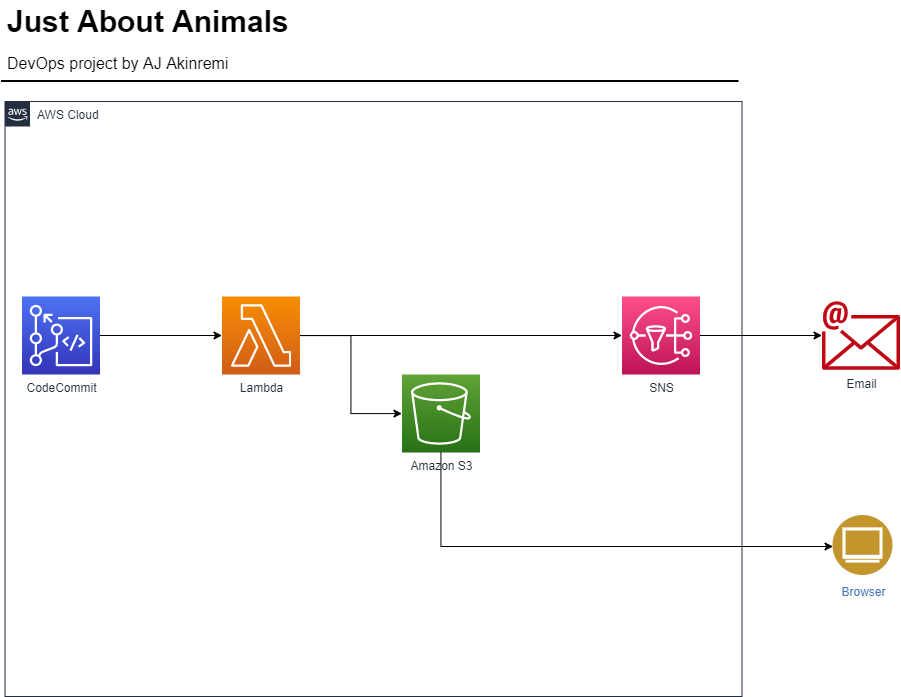
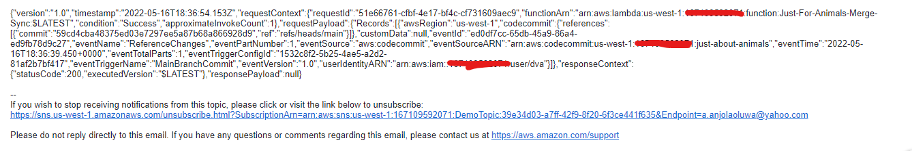

# Just About Animals - A DevOps Project



This project showcases the deployment of a static website, maintained using DevOps concepts of Continous Integration, Continous Deployment, and Alerting.

The website is hosted on Amazon S3. The code repository is hosted on AWS CodeCommit, with a trigger to an AWS Lambda function which copies the latest commit code on the main branch to the Amazon S3 bucket. 

## Website Design
Designed using HTML, CSS, and the Bootstrap CSS framework.

## Version Control - Repository
Hosted on AWS CodeCommit

## Alerting - Amazon Simple Notification Service
A SNS Topic was created to send email to SNS Subscriptions (email address(es)). Subscribed emails have to accept an invitation behind being able to receive messages from the SNS Topic.


## Automation - AWS Lambda Function
This function written in Python 3.6 is called everytime a CodeCommit Main branch push is successfully done. It also includes destination triggers to notify the Developer (via email) of whether the Lambda function is able to successfully deployed the code to the S3 bucket or not. An Identity & Access Management Role was created to grant the function permissions to:
- Read code from the repository (AWSCodeCommitReadOnlyAccess)
- Read and Write objects to the S3 bucket
- Read and Write logs to Amazon CloudWatch
- Write events to the SNS Topic

## Amazon S3 Bucket
A Public Access S3 bucket created in Amazon's us-west-1 region. This bucket holds all files the website needs to serve (Images, html, css, etc). Also included is a S3 Bucket Policy to allow public users to retrieve files from the S3 Bucket.

```
{
    "Version": "2012-10-17",
    "Statement": [
        {
            "Sid": "PublicReadGetObject",
            "Effect": "Allow",
            "Principal": "*",
            "Action": "s3:GetObject",
            "Resource": "arn:aws:s3:::<BucketName>/*"
        }
    ]
}
```